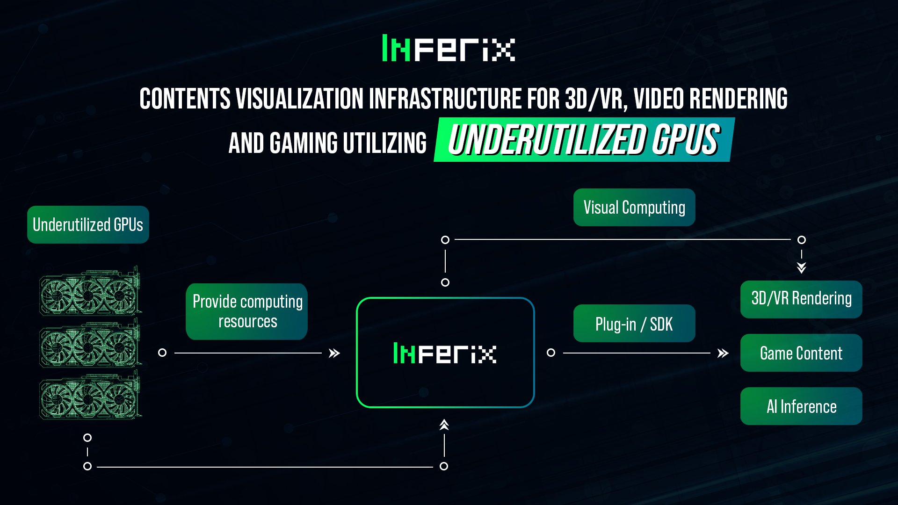

# Overview

<figure><figcaption></figcaption></figure>

## Welcome to Inferix!

Inferix is a Decentralized GPU Network for Visual Computing and AI. &#x20;

* For users (3D graphic artists, game developers, enterprises) who need GPU computing power for rendering high-quality graphics, you can use Inferix system to continuously access these precious resources with faster processing time and more efficient spending.
* As GPU computing owners, you are enabled to share idle GPUs to InferiX network for rendering 3D graphics, AI inference and earn long-term passive income while simultaneously balancing your main jobs or leisure activities

Check out the full dedicated thread to learn more Inferix 👇



### **The industry of 3D/VR/Render**

InferiX's solution meets real-world problems across a range of industries, not only for the AI field but also for high-quality rendering needs

<figure><figcaption></figcaption></figure>

### Can I use Inferix today?

**✦ Inferix MVP** is now ready for everyone to try out & make first contributions without registering wallet/logging in, check out 👇


[tutorial-mvp-for-designers-and-gpu-owners.md](../inferix-mvp/tutorial-mvp-for-designers-and-gpu-owners.md)


**✦** Fill out the Google form now to gain access to the **POR MVP** 👇&#x20;


[por-mvp.md](../inferix-mvp/por-mvp.md)

