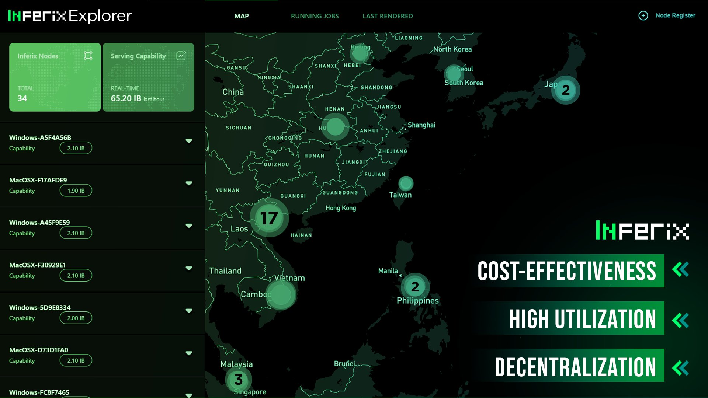

---
layout:
  title:
    visible: true
  description:
    visible: false
  tableOfContents:
    visible: true
  outline:
    visible: true
  pagination:
    visible: true
---

# Inferix Explorer

<figure><figcaption></figcaption></figure>

Users can visualize real-time overview of Inferix Network: Node Map, Running Jobs, Last Rendered, GPU capabilities and more!

Elevate End-users & GPU providers' experience: [HERE](http://dash.inferix.io) &#x20;
