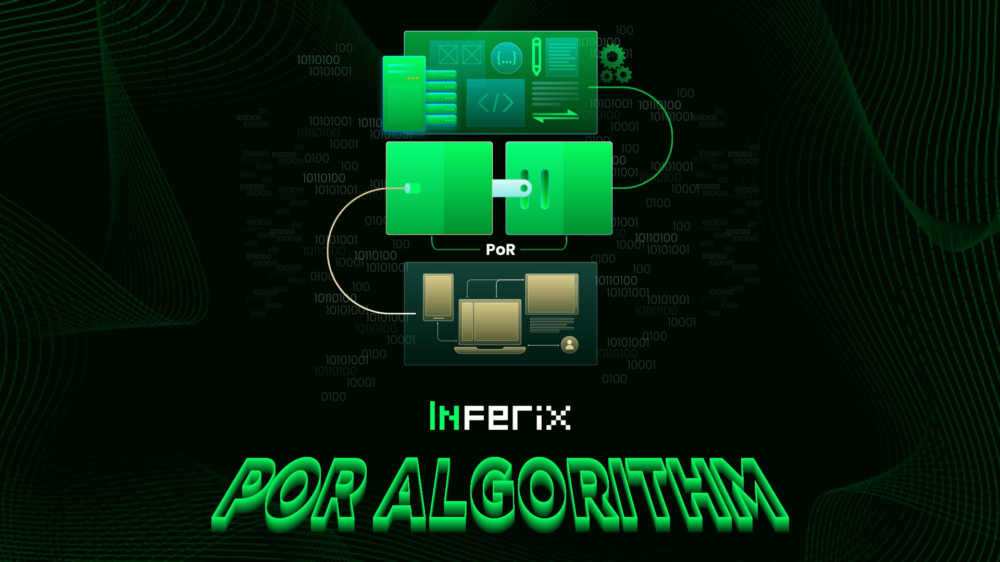

# Proof-of-Rendering (PoR)

### What is Proof-of-Rendering (PoR)?

Proof-of-Rendering (PoR) stands as a fundamental technology within InferiX, offering analysis, consensus, and validation algorithms tailored specifically for the rendering tasks performed by GPU resource providers.

<figure><figcaption></figcaption></figure>

Within Inferix, rendering costs are determined by the **Proof-of-Rendering (PoR)** Algorithm, which operates akin to the **Proof-of-Work** (PoW) Algorithm utilized in Bitcoin mining.

At the beginning of each worker's session, the proof-of-rendering will run for a short period, evaluating the rendering capabilities of the GPU system within the worker. This process is carried out through the [**Active Noise Generation**](active-noise-generation.md) and [**Active Noise Verification**](https://docs.inferix.io/inferix-system/proof-of-rendering-por/active-noise-generation#id-2.-active-noise-verification) algorithms.

The result of this test provides a crucial metric for measuring the worker's rendering capabilities, called the **Inferix Bench** (IB). The IB is used in conjunction with the [**Inferix Bench Minutes Efficiency**](broken-reference) (IBME) parameter to determine the unit price per minute of GPU usage and calculate the corresponding user fees.
