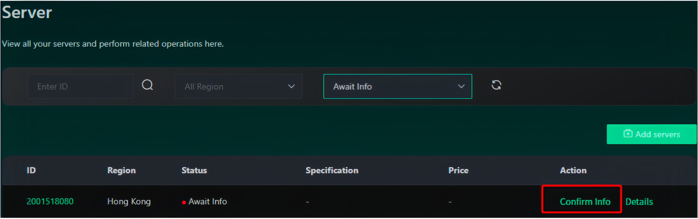

# Adding GPUs to the Network

### For GPU Providers

To participate you will need:\
&#xNAN;**- Linux-based server**\
**- A public IP address and a worker that can be accessed via SSH**\
**- A computer with a GPU equivalent to RTX 3090 or above.** \
&#xNAN;_&#x46;ind the compatible GPUs and their details below_ :point\_down:


[gpu-staking.md](gpu-staking.md)


***

#### STEP BY STEP GUIDE

1. **Register for an account** \
   Go to https://provider.inferix.io/ and use your gmail to create your account. (Once your registration is approved, you will receive an onboarding email shortly from our official email address: <mark style="color:blue;">contact@inferix.io</mark>)\

2. **Set Up the Wallet Address** \
   The system currently supports MetaMask wallet extension. After successfully logging in, navigate to the _**Settings**_ page and configure your wallet address. Please note that this address cannot be changed later, and all subsequent website operations will be linked to this wallet.\

3. **Get tIFX Tokens**\
   Contact the Inferix team on our [official discord channel](https://discord.gg/q5gBts3Q6x) to buy tIFX tokens for staking and mining. **The price for testnet1 is 1 tIFX = 0.05 USDT.**\
   **T**he required amount of tokens for staking vary based on the GPU mode&#x6C;**, Refer  to the table on** [**"GPU Staking"**](gpu-staking.md):point\_down:


[gpu-staking.md](gpu-staking.md)


4. **Add GPU Servers**&#x20;

A. Go to _**Server → Add Servers**_, and copy the command line provided

<figure><figcaption></figcaption></figure>

B. Run the command on your GPU server with root privileges. Currently, only Linux-based servers are supported for joining the network. \
\
C. Return to the _**Server**_ page, and you will see the server you just added displayed with the status _**Await**_ Info. Click the _**Confirm Info**_ button, fill in the public IP and port for SSH access, select the GPU model, and submit. The server's status will change to _**Pending Review**_. At this point, you can either wait for our operations team to review it or actively contact us to expedite the review process.

<figure><figcaption></figcaption></figure>

D. While the server is in the _**Pending Review**_ status, the operations team will see the review request on the management platform. They will use the provided SSH IP, port, and key file to log in to the server and verify its configuration. If everything checks out, they will click _**Approve**_ to allow the server to join the network. If the server remains in the _**Pending Review**_ status for an extended period, you can contact the operations team for assistance

5. **GPU Staking**&#x20;

When the provider user sees the server status change to _**Await Stake**_ on their _**Server**_ page, they can proceed with the staking operation. Clicking the **Stake** button will trigger the MetaMask wallet, displaying the staking amount. This action will call the smart contract to lock the staking amount within it. \
\
It’s important to note that the staking requirements vary based on the GPU model. Please refer to the table here: [GPU STAKING ](gpu-staking.md)

<figure><figcaption></figcaption></figure>

Once the staking operation in the previous step is completed, the server status will change to _**Online**_, indicating that it has successfully joined the Inferix\_Testnet and started mining

***

&#x20;**VIDEOTUTORIAL**&#x20;


