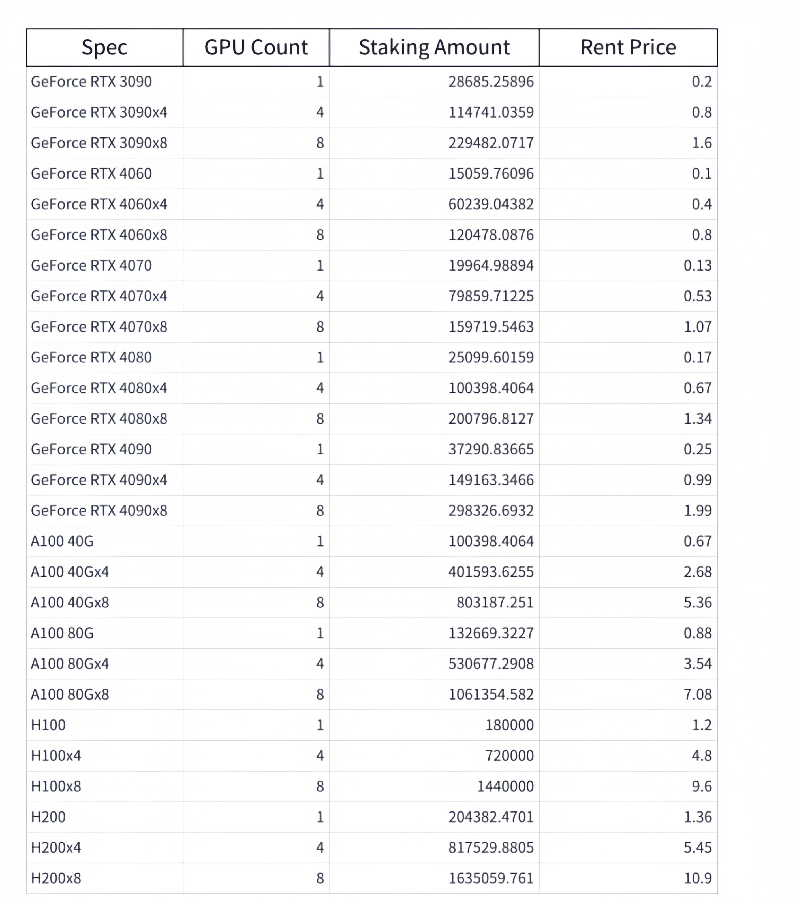

# GPU Staking

### **Staking Requirements**

The **K-value** in the table is a multiplier factor calculated based on various factors such as GPU procurement cost, VRAM size, and market demand. It is used to comprehensively evaluate the performance and value of each GPU. The K-value directly impacts the staking amount required for GPUs and their rental costs. \
\
Currently, the test network adopts the standards shown in the table. The staking requirements and rental costs will be updated periodically based on network conditions and market trends. These updates will not affect GPUs that have already been staked or orders that have already been paid for.

<figure><figcaption></figcaption></figure>

### **Unstaking**&#x20;

If you wish to remove a GPU from the network, you can complete the process by clicking the **Unstake** button. Once unstaked, the initially staked tokens will be locked for 180 days before being returned to the wallet used for the operation.&#x20;

Currently, the test network does not support unstaking.
