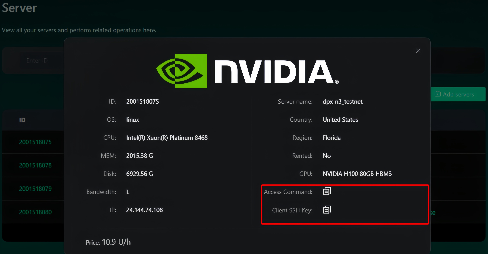

# Renting GPU Devices

1.  **Log in to the Website**\
    Use your Gmail account to log in at: [https://cloud.inferix.io/](https://cloud.inferix.io/) (Once your registration is approved, you will receive an onboarding email shortly from our official email address: contact@inferix.io)\

    It is recommended that the username and wallet used on the Rent website be different from those on the Miner website.\

2. **Set Up the Wallet Address** \
   After successfully logging in, navigate to the Settings page to configure your wallet address. Please note that this address cannot be changed later, and all subsequent website operations will be linked to this wallet.\

3. **Rent a GPU Server** \
   A. Go to _**Server → Rent Servers**_. \
   \
   B. Select the required GPU model and region. From the listed servers, choose the desired machine and proceed to make the payment. \
   \
   C. Return to the _**Server**_ list, and after approximately 3 minutes, you will see the rented machine. Click **Details** to retrieve the SSH command for accessing the machine. Using the provided SSH IP, port, and key file, you can log in to the rented machine

<figure><figcaption></figcaption></figure>
