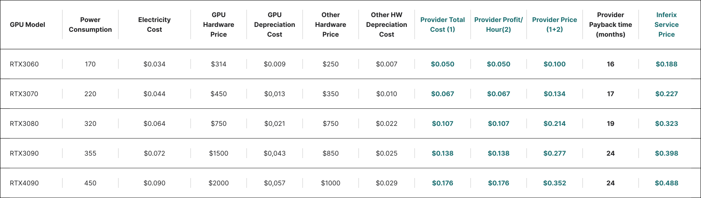

# Appendix B: Price simulation details

[Table 17](#fig_price_simulation_details) contains price simulation detailed data. We are calculating the Provider's input costs, which include electricity costs and hardware depreciation. The calculations are standardized for a single GPU device.

#### Table 17 

<figure><figcaption>Price simulation details</figcaption></figure>

_Electricity Cost_ is calculated based on the power consumption of the device multiplied by the assumed unit price of $0.20/kW h. Hardware depreciation costs are calculated based on a general assumed depreciation rate of 25% per year for both the GPU and other PC components._Provider Price:_ The suggested unit price for Providers is calculated as double the Provider's input costs per GPU per hour.The input cost for Inferix is calculated by adding the storage costs to the Provider price. This storage cost is based on the assumption that each 3D scene requires 1 GB of short-term storage for 96 hours and 100 MB of long-term storage, with a rate of $0.05/GB per month._Inferix Service Price_ is calculated by adding a 20% commission for Inferix Foundation to the input cost.
