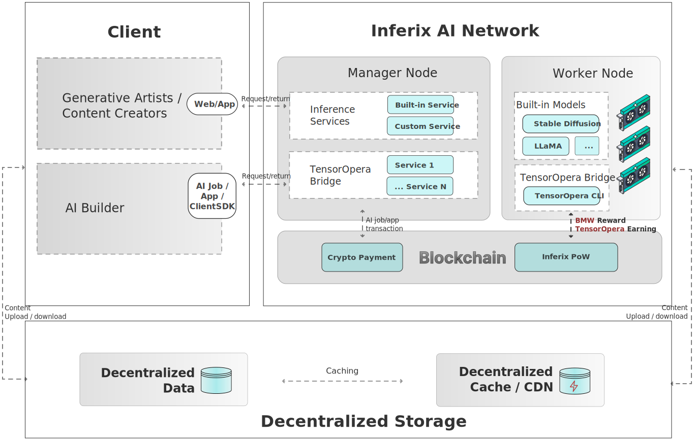

# Inferix AI

From the information presented above, we can conclude that the hardware of the Inferix network is well-suited to serve as an infrastructure for federated AI. Next, we will discuss the design of the Inferix Federated AI system.

<figure><figcaption>
Inferix and TensorOpera integrated architecture
</figcaption></figure>

In the architectural design (c.f.\~\cref{fig:inferix\_tensoropera\_integrated\_architecture}), Inferix enables \emph{generative AI artists} and content creators to access AI models trained by \emph{AI Builders} within the Inferix community, as well as models trained by the Inferix Team itself (built-in models). These services can be hosted on the Inferix Manager Node system or on the TensorOpera AI platform.

AI Builders have the option to run their models directly on the Inferix infrastructure or through the TensorOpera Bridge. The output result can be hosted in Inferix infra with custom domain option.

In addition to handling graphics rendering tasks, Inferix GPU Nodes also serve as Federated Learning Clients by running the Inferix TensorOpera CLI.

* _TensorOpera CLI:_ the CLI client that is built based on TensorOpera open source with Inferix PoW algorithm integrated.
* _Inferix PoW:_ general PoW algorithm used to calculate the actual work performed by workers, excluding those involved in rendering tasks. Inferix PoW is based on the Proof-of-Rendering mechanism to calculate the Inferix Bench (c.f.\~\cref{subsec:inferix\_bench\_ibme}), incorporating an algorithm to accurately measure the actual working time of a node.
