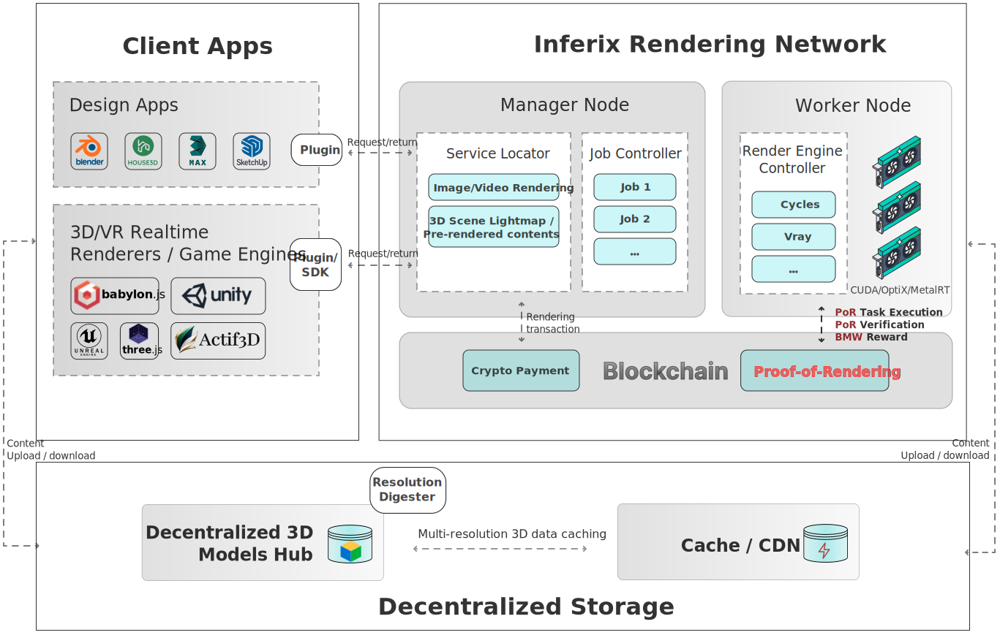

# Decentralized visual computing

Inferix is a decentralized physical GPU network connected to end users, graphic software, or AI models through a feature-rich software layer that is continuously expanded by Inferix Labs and the community of developers within the Inferix ecosystem. Inferix is built upon the core PoR algorithm, which integrates both on-chain and off-chain verification. This section will outline the system architecture and key design details of the Inferix decentralized GPU system.

#### Figure 11: 
<figure><figcaption>
Inferix decentralized rendering architecture
</figcaption></figure>

The system architecture of the Inferix network is described in [Figure 11](#fig_decentralized_rendering_architecture), consisting of three main components: Manager Node, Worker Node, and Client Apps. Data is stored and accessed through a Decentralized Storage System.
