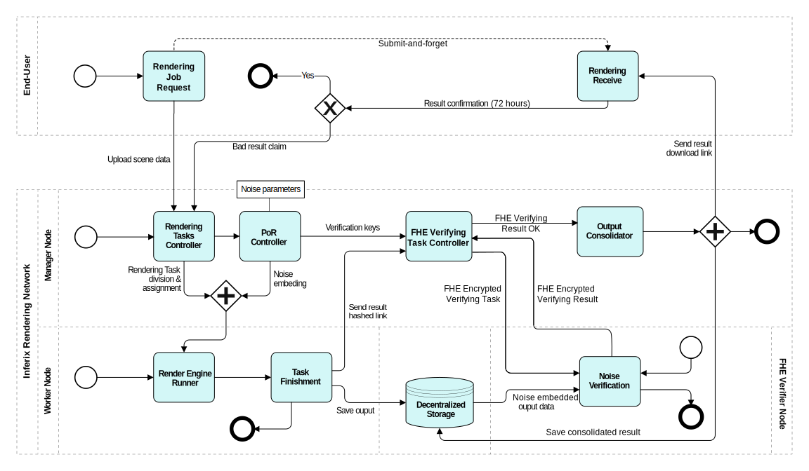

# Verifier data security enhancement with FHE

Verifier is the component that receives the least amount of data among the three main components of the Inferix network. The input data for a Verifier includes a random subset of the rendering job's output along with the algorithm and key to verify it. Rendering jobs that do not require high data security will be executed by standard Verifiers. Otherwise, those that require high data security will be executed by secure Verifiers. Inferix uses Fully Homomorphic Encryption (FHE) [\[5\]](../../references.md#5), [\[6\]](../../references.md#6), [\[24\]](../../references.md#24) technology on secure Verifiers to ensure that end-user data is completely protected from leakage. The hardware requirements for secure Verifiers are higher than those for standard Verifiers, and specifically, these nodes must be equipped with GPUs.

#### Figure 12: 
<figure><figcaption>
Rendering flow with PoR and FHE
</figcaption></figure>

[Figure 12](#fig_por_with_fhe) illustrates the operation of the PoR algorithm combined with FHE. All information related to the verifying task including the rendering output data and verification key is encrypted using FHE and sent back to Manager node. The verification result is then sent back to the Manager node for review, while the Verifier remains completely unaware of the content of the verification process or the verification result.
