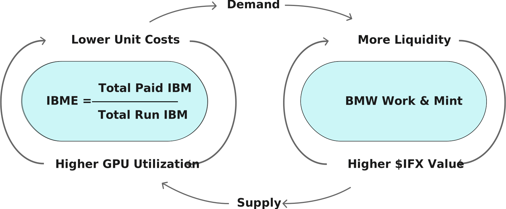

# IBME

Short for _Inferix Bench Minutes Efficiency_, is an index used to evaluate the working efficiency of a set of nodes $$\mathcal{N}$$ over a working period $$P$$, determined by the formula of the total IBM paid over the total apparent IBM:

$$
\text{IBME}_{P}\left(\mathcal{N}\right) \triangleq \frac{\sum_{n \in \mathcal{N}} \text{IBM}_P \left(n\right)}{\sum_{n \in \mathcal{N}} \text{IBM}_P^a \left(n\right)}
$$

where $$\text{IBM}_P \left(n\right)$$ is the customer paid IBM for node $$n$$ and $$\text{IBM}_P^a \left(n\right)$$ is the apparent IBM of node $$n$$ calculated by multiplying the IB of a node by the elapsed time (in minutes) of period $$P$$. We observe that IBME is always a figure below 100% and the higher the IBME ratio, the more efficiently the network operates.

#### Figure 15: 
<figure><figcaption>
IBME flywheel
</figcaption></figure>

Recent reports from DePIN projects have highlighted a significant issue: while the number of nodes participating in the network is very high, many of these nodes are either inactive or active but not receiving any service requests. Inferix solve this problem by controlling the IBME.

In addition to planning and adjusting the [Emission Plan](../burn-mint-work-token-issuance-model.md), IBME also assists Inferix Governance in making decisions related to the use of the Inferix Foundation's funds for promotional activities aimed at increasing supply or attracting service demands.
