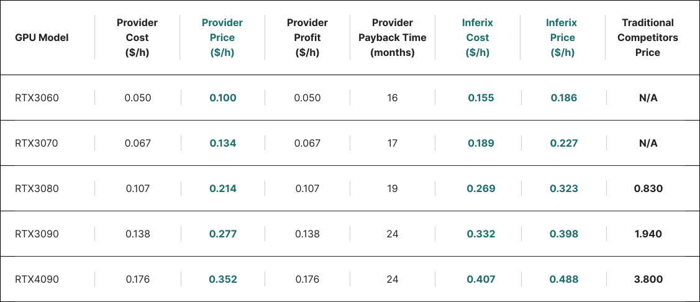

# Price simulation

Now, we will build a price simulation for Inferix's GPU rendering service and compare Inferix's price competitiveness with traditional Cloud Rendering services. The details of these calculations are listed in [Appendix B](/inferix-whitepaper/appendix-b-price-simulation-details.md). The table in [Figure 15](#fig_pricing_simulation) shows the most important information.

#### Figure 15: 

<figure><figcaption>Price simulation</figcaption></figure>

In this simulation, the calculations are standardized for a single GPU device. The _Provider Price_ refers to the minimum service price that a GPU Provider will set to ensure that revenue is always twice the cost per hour of operation.

In the best-case scenario, where GPUs receive enough tasks to operate full-time every day, providers can break even in no more than 17 months for the RTX3060, RTX3070, and RTX3080 models, and 24 months for the RTX3090 and RTX4090 models. However, since the RTX3090 and RTX4090 models are better suited for federated AI tasks, their IBME scores may be higher. Moreover, the choice of which GPU model to use for rendering also depends on whether the customer prioritizes shortening the rendering time or prefers a more reasonable price. Therefore, the decision on which device to invest in depends on the specific conditions of each individual in particular market conditions.

A crucial point to note here is that with the proposed _Provider Price_, Inferix’s service price is the equivalent of only from 12\% to 38\% of the average price in the traditional cloud rendering market at the time of writing this paper [[30]](/inferix-whitepaper/references.md#30), [[31]](/inferix-whitepaper/references.md#31), [[32]](/inferix-whitepaper/references.md#32). This means that providers can adjust the price higher to shorten the payback period.

_**Price of 1 IBM**_: Based on the previously discussed calculation method for [IBM](/inferix-whitepaper/economic-model/inferix-bench-and-ibme/ib-and-ibm.md), the price of 1 IBM is approximately \$0.016 according to this pricing simulation.
