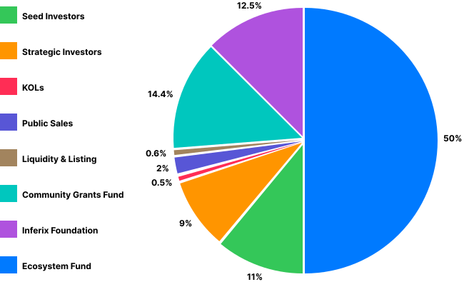

# Token allocation

The token allocation of $IFX is depicted in the following [token allocation chart](token-allocation.md#token-allocation-chart), that includes:

#### Token allocation chart: 

<figure><figcaption>
$IFX token allocation
</figcaption></figure>

* _**Investors:**_ Inferix raises capital from investors, including Seed, Strategic, KOLs, and Public Investors, using $$22.5\%$$ of $IFX total supply.
* _**Liquidity and listing:**_ $$0.6\%$$ for DEX and CEX.
* _**Community grants fund:**_ $$14.4\%$$ for:
  * initial airdrop for OG members,
  * initial grants for GPU providers,
  * education grants for using Inferix in schools.
* _**Ecosystem fund:**_ $$50\%$$ for:
  * staking reward,
  * PoR reward using BMW,
  * Inferix platform expansion projects,
  * Inferix hackathon and bug fixes,
  * Inferix DAO building.
* _**Inferix foundation:**_ $$12.5\%$$ for:
  * Inferix Labs operation activities,
  * Inferix global expansion.
