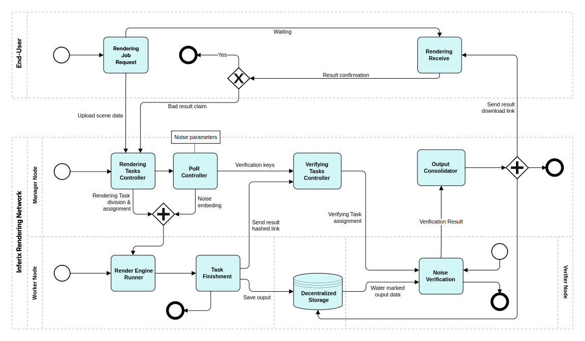

# Integration

We integrate the Active Noise Generation and Verification scheme into the [original rendering flow](/inferix-whitepaper/introduction/rendering-network-using-crowdsourced-gpu.md#rendering-network-using-crowdsourced-gpu) by placing respectively the noise generation and the noise verification into the rendering task controller of the _manager_ and the proof-of-rendering verification of the _verifier_. The completed flow is depicted in [Figure 7](#fig_rendering_flow_with_angv).

#### Figure 7 
<figure><figcaption>
aa
</figcaption></figure>

In the introductory section of the paper, we have discussed the [problem of rendering verification](/inferix-whitepaper/introduction/rendering-verification-problem.md), that is to automatically verify whether the submitted scenes of users are genuinely rendered or not. The ANGV is proposed to deal with the challenge, ANGV serves then as a _proof of rendering_ (PoR), inspired from the _proof of ownership_ schemes [[2]](/inferix-whitepaper/references.md#2), [[3]](/inferix-whitepaper/references.md#3). Other components of the Inferix network simply refers PoR for the underlying ANGV algorithm.
