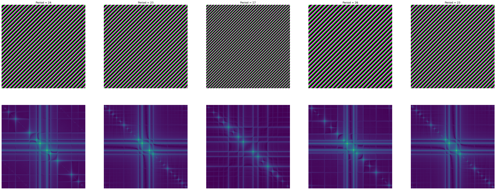

# Implementation

In the previous section, we have presented the high-level description of the Active Noise Generation and Verification algorithms. In this section, we discuss in detail the current implementation of noise generation and verification.

## Structure of noise

Following [Equation 2](algorithms.md), a noise is a random vector $$W = \left(w_i\right)_{1 \leq i \leq n}$$ where each $$w_i$$ is independently chosen from a normal distribution $$\mathcal{N}\left(\mu, \sigma^2\right)$$. The atomic watermark $$w_i$$ is implemented a rectangular image of periodic patterns as follows:

 * let fix some values $M,N$ for the width and the height of the rectangle, and
 * let $$\mathcal{X}_i, \mathcal{Y}_i$$ be independent normal random variables:
   $$
   \begin{equation}
        \mathcal{X}_i \sim \mathcal{N}\left(\mu, \sigma^2\right) \quad \mathcal{Y}_i \sim \mathcal{N}\left(\mu, \sigma^2\right)
    \end{equation}
   $$
   then take $$X_i, Y_i$$ be respectively some samples of $$\mathcal{X}_i, \mathcal{Y}_i$$.

The complex atomic signal $$w_i$$ is defined by:
$$
\begin{equation}
w_i(x,y) = A e^{2i\pi\left(\frac{x}{X_i} + \frac{y}{Y_i}\right)} \ \left(0 \leq x < M, 0 \leq y < N \right)
\end{equation}
$$
for some amplitude $A$. We observe that $$w_i\left(x,y\right) = w_i\left(x + X_i, y\right) = w_i\left(x, y + Y_i\right) \, \forall x,y$$ then $$X_i, Y_i$$ are actually the horizontal and the vertical periods.

The [Figure 4](implementation.md#structure-of-watermark) shows a noise as a vector of $$5$$ atomic watermarks and the Fourier transformations showing the corresponding frequency characteristics. For illustration purpose, we take $$X_i = Y_i$$ where $$X_i \sim \mathcal{N}\left(25,5\right) \ \left(1 \leq i \leq 5\right)$$, and $$M = N = 512$$.

<figure><figcaption>
Figure 4: A random vector of 5 atomic watermarks
</figcaption></figure>

The frequency characteristics of atomic watermark signals play a crucial role in the noise verification since they help to distinguish embedded noises from the original signals of the image. The characteristics are completely determined by the periods $X_i, Y_i$ given fixed $M,N$ since the discrete Fourier transform in [Proposition 1](implementation.md#Proposition 1 (Fourier transform of complex atomic signal)). In turn, these periods statistically rely on the expectation $$\mu$$ by [Equation 1](implementation.md), we will discuss the computation of this value in [Noise verification](implementation.md#noise-verification).

#### Proposition 1 (Fourier transform of complex atomic signal)
$$
\begin{equation*}
    F\left(u,v\right) = \frac{A}{M \times N} \frac{\left(1 - e^{2i\pi \frac{M}{X_i}}\right) \left(1 - e^{2i\pi \frac{N}{Y_i}}\right)}{\left(1 - e^{2i\pi\left(\frac{1}{X_i} + \frac{u}{M}\right)}\right) \left(1 - e^{2i\pi\left(\frac{1}{Y_i} + \frac{v}{N}\right)}\right)}   
\end{equation*}
$$

The size $$n$$ of the random vector is one of the principal factors which decides the robustness of noise: the higher value of $$n$$ the lower the false positive of noise verification. This value influences the quality of the rendered image: the lower value of $$n$$ the higher fidelity of the rendered images. Consequently, the value of $$n$$ is a trade-off between the robustness of the embedded noise and the fidelity of the rendered image, this value is empirically chosen to be about $$5$$ to $$8$$.

#### Remark
We need a stronger requirement for [Equation 1](implementation.md): the random variables $$\left\{ \mathcal{X}_i, \mathcal{Y}_i \mid 1 \leq i \leq n\right\}$$ are independent.

## Noise generation
Given a graphics scene $$S$$, the random vector $$W = \left(w_i\right)_{1 \leq i \leq n}$$ is embedded into $$S$$ by first wrapping each atomic $$w_i$$ by a graphical object: let denote it $$\omega_i$$, then we obtain a vector of objects $$\Omega = \left(\omega_i\right)_{1 \leq i \leq n}$$. Next by inserting $$\Omega$$ into $$S$$ so that every $$\omega_i$$ contribute to the rendered image, namely they distort this image, but the distortion must be kept so that it is lower than the human perception of light.

### Position constraints of noise objects
By the nature of physically based rendering [\[3\]](../references.md), an object in the scene will not be visible if and only if there is no light (or the light is out of the capability of the sensor) scattered from the surface of the object to the camera. This may be caused by several reasons: the object is not located in the frustum of the camera, is hidden by other objects, or the object is made of some transparent material. Furthermore, the atomic signals $$w_i \ \left(1 \leq i \leq n\right)$$ should not interfere themselves since this makes the noise verification to be unnecessarily complicated. In summary, we require that the noise embedding to satisfy first the following constraints:
 * there are no collisions between $$\omega_i \ \left(1 \leq i \leq n\right)$$,
 * vector $$\Omega$$ is completely located in the camera frustum,
 * no $$\omega_i$$ is hidden by another object (including both $$\omega_j \in \Omega$$ where $$j \neq i$$ and objects of the scene).

### Direction constraints of noise objects
As previously mentioned, the information about characteristics of atomic noises in frequency domain are crucial in noise verification. We need to restore a certain amount of this information from very small distortions made by the objects $$\omega_i \in \Omega$$ on the rendered image, then we want that the distortion of $$\omega_i$$ is of the same shape as the atomic noise $$w_i$$ for all $$1 \leq i \leq n$$.

Geometrically, in graphics rendering, each $$\omega_i$$ has a __rotation vector__ which characterizes the direction of the object in the global coordinate system (i.e. world space [\[3\]](../references.md)) containing all objects of the graphics scene $S$. To keep the rectangular shape of the distortion of $$\omega_i$$, we require that:
 * the rotation vector of $$\omega_i$$ is equal with the rotation vector of the digital camera of $$S$$ for all $$\omega_i \in \Omega$$.

## Noise verification
