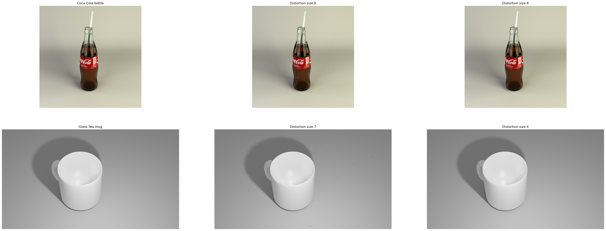

# Distortion region

Under constraints about position and direction of noise objects, the imprint of $$\omega_i$$ on the rendered image is a rectangular region denoted by:

$$
k_i \triangleq \left(x_i^{\mathtt{ul}}, y_i^{\mathtt{ul}}, x_i^{\mathtt{lr}}, y_i^{\mathtt{lr}} \right)
$$

where $$\left(x_i^{\mathtt{ul}}, y_i^{\mathtt{ul}}\right)$$ and $$\left(x_i^{\mathtt{lr}}, y_i^{\mathtt{lr}}\right)$$ are respectively the upper left and lower right positions in the image coordinate system. It is important to note that $k\_i$ for all $$1 \leq i \leq n$$ can be computed without rendering the scene $$G$$.

For the size of distortion regions, similar with the length of the noise random vector, there is a compromise between the robustness of the embedded noise and the fidelity of the rendered frame. The larger the distortion $$k_i$$, the higher information of $$w_i$$ can be restored then the higher robustness of the noise verification; but the lower the distortion $$k_i$$, the higher fidelity of the image. Empirically, we use the bounds $$4 \leq x^{\mathtt{lr}}_{i} - x^{\mathtt{ul}}_{i},\ y^{\mathtt{lr}}_{i} - y^{\mathtt{ul}}_{i} \leq 7$$ for all $$1 \leq k \leq n$$.

<figure><figcaption>
Rendered watermarked scenes (random vector length 12)
</figcaption></figure>

The figure above shows some distortion results of rendering watermarked scenes. From two original scenes, noise vectors of length $$12$$ with different distortion sizes are embedded, then different watermarked scenes are generated. When rendering the scenes containing noises whose distortion sizes are $$7$$ or $$8$$, the distortions are visible under the form of small rectangles dispersed in the rendered images. In contrast, when the sizes are $$4$$ or $$5$$, the distortions are imperceptible.

_Remark:_ While the atomic watermarks are quite large, the distortions made by them on rendered images are constrained relatively small. The figure in the previous section shows atomic watermarks of size $$512 \times 512$$ which are used for watermarking scenes shown in the figure above, their imprints are about $$4 \times 4$$. The sizes of the rendered images are much larger: $$1080 \times 1080$$ and $$1920 \times 1080$$.
