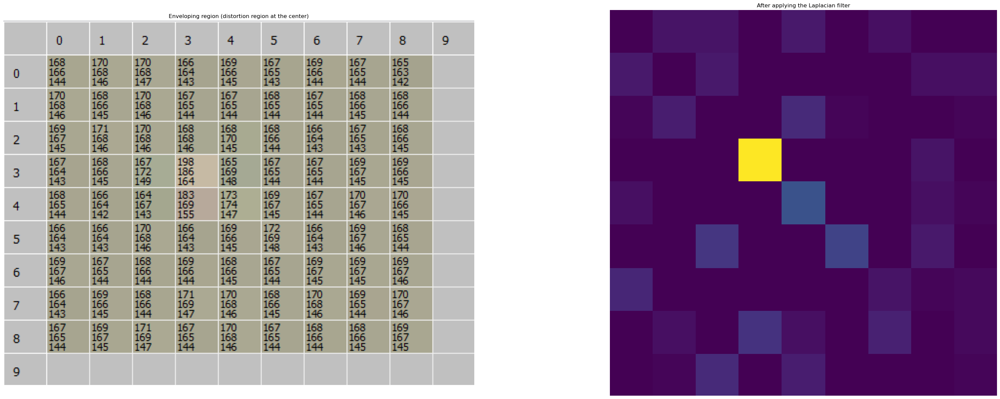

# Noise verification

Given a tested image $$J$$ and a verification key $$K = \left(k_i\right)_{1 \leq i \leq n}$$, the goal of noise verification is to recover and check the trails of noises in $$J$$ at all regions $$k_i$$. For each $$k_i$$, we pick an atomic enveloping region $$v_i$$ determined by:

$$
v_i \triangleq \left(x^{\mathtt{ul}}_i - \delta^{x}_{i}, y^{\mathtt{ul}}_{i} - \delta^{y}_i ,x^{\mathtt{lr}}_i + \delta^{x}_{i}, y^{\mathtt{lr}}_{i} + \delta^{y}_{i}\right)
$$

where $$\delta^{x}_{i}$$ and $$\delta^{y}_{i}$$ are the width and the height of $$k_i$$:

$$
\delta^{x}_{i} = x^{\mathtt{lr}}_i - x^{\mathtt{ul}}_i + 1 \qquad \delta^{y}_{i} = y^{\mathtt{lr}}_i - y^{\mathtt{ul}}_i + 1
$$

Since any enveloping region is so small that spectral analysis cannot give reliable results, hence to filter the distortions of noises (i.e. the trails of high energy) we compare gradients of the region and the contained distortion region; one way to do that is using the Laplacian filter. Let $$abla^2$$ denote the Laplacian operator, calculate the mean of each enveloping region $$v_i$$:

$$
\overline{v}_i = \frac{1}{\lvert v_i \rvert} \sum\limits_{\left(x,y\right) \in v_i} \left( \nabla^2 v_i \right) \left(x,y\right)
$$

and the mean of corresponding distortion region:

$$
\overline{k}_i = \frac{1}{\lvert k_i \rvert} \sum\limits_{\left(x,y\right) \in k_i} \left( \nabla^2 v_i \right) \left(x,y\right)
$$

where $$\lvert v_i \rvert$$ and $$\lvert k_i \rvert$$ are respectively the area of $$v_i$$ and of $$k_i$$. Then compare the deviation (c.f.\~\cref{equ:noise\_recovery,equ:noise\_difference}):

$$
e_i \triangleq \lvert \overline{v}_i - \overline{k}_i \rvert
$$

with some energy threshold. Using the noise tuning discussed in\~\cref{subsec:noise\_spreading}, we experimentally accept the existence of the atomic watermarked $$w_i$$ when $$e_i \geq 5$$.

If there is a distortion region where the deviation $$e_i$$ is lower than the threshold then the image $$J$$ is immediately rejected, otherwise $$J$$ is accepted.

_Remark._ From the construction of enveloping regions from distortion regions, the areas can be simply calculated by $$\lvert k_i \rvert = \delta^{x}_{i} \times \delta^{x}_{i}$$ and $$\lvert v_i \rvert = 9 \times \lvert k_i \rvert$$.

<figure><figcaption>
Noise verification using Laplacian filter
</figcaption></figure>
