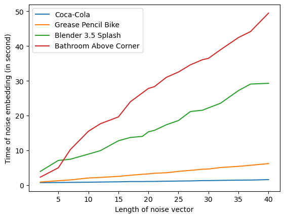
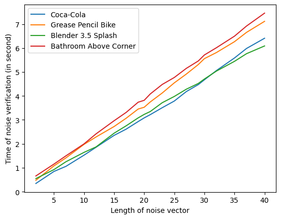

# Performance evaluation

We evaluate the execution time of noise insertion and noise verification on several scenes, the lengths of the noise vectors variate from 2 to 40. The tests are executed on a workstation of Intel:registered: Core:tm: i5 2.5 GHz CPU, 32 GB RAM and NVIDIA GeForce RTX3070 GPU. The performance of noise insertion and verification is given in the figures below, detailed data is given in tables in [Appendix D](/inferix-whitepaper/appendix-d-performance-evaluation-data.md).

#### Figures 9-10: 

<figure><figcaption>
Noise insertion
</figcaption></figure>
<figure><figcaption>
Noise verification
</figcaption></figure>

The noise insertion needs to analyze the structure of the input scene to generate and insert noises, that explains the noise insertion experimental results where the execution time, while being proportional with the length of the noise vector, depends importantly on the complexity of input scenes. A loose quantification for this complexity can be observed via the execution times needed to render the scenes, shown in\cref{fig:rendering_time_of_scenes}.

Whereas the noise verification needs only to analyze the distortion regions whose locations are given by the verification key, then the execution time depends mostly on the number of the regions (which is also the length of the noise vector) and slightly on the size of the rendered frame.