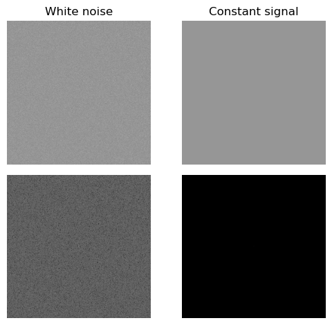

# Attacks on noises

Another kind of attack is based on analyzing rendered frames to predict the possible positions of distortion regions. Below is a simple result for extreme cases.

_**Proposition 4.**_ Let $$I = \mathcal{R}\left(S\right)$$ be the rendered frame of some scene $$\mathcal{S}$$, if $$I$$ is a constant signal or white noise then ANGV scheme is perfectly secure.

_**Proof.**_ We prove for the case of constant signals, the argument for white noises is similar. For simplification, we do not take the constraints about the fidelity of watermarked signals in to account and suppose that $$I$$ is the constant binary signal $$I\left(x,y\right) = 0$$. The distortions of any noise vector of length $$n$$ occurs at distinguished and uniformly random positions $$\left(x_i,y_i\right)_{1 \leq i \leq n}$$ on the image, or $$\hat{I}\left(x_i,y_i\right) = 1$$ for all $$1 \leq i \leq n$$. Since $$K_{\mathtt{verif}}$$ is a cryptographic hash, $$P_{\mathcal{C}} = P_{\mathcal{S}} = \mathcal{U}_{I}^{\otimes n}$$, hence $$D\left(P_{\mathcal{C}} \mathrel{\Vert} P_{\mathcal{S}}\right) = 0$$.

Many researchers observe that the data watermarking can be considered as the communication over noisy channel where the watermarks are signals and the content data is noise [[8]](/inferix-whitepaper/references.md#8), [[21]](/inferix-whitepaper/references.md#21). Under this perspective, the proposition above is actually a special case of the Shannon's noisy channel coding theorem. The spectrums of signals (as depicted in [Figure 8](#fig_trivial_signals)) are Dirac pulses for constant signals and white noises for white noises, then noises can be indistinguishably inserted everywhere. From the attacker's point of view, there is no information to make any significant estimation about the positions of the watermark.

#### Figure 8 

<figure><figcaption>
Trivial signals and magnitude spectrums
</figcaption></figure>
