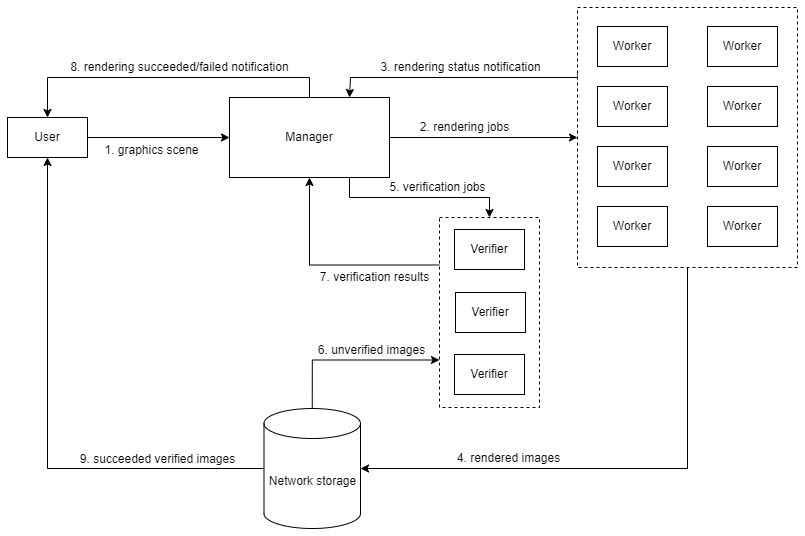

# Proof of Rendering

### Rendering network

The graphics rendering service consists of a network of decentralized machines called _nodes_ which are of $3$ kinds: _manager_, _worker_ and _verifier_. The _managers_ and _verifiers_ are dedicated machines of Inferix while the _workers_ are machines joined by GPU owners. The number of _workers_ is normally much larger than the number of _managers_ and _verifiers_.

<figure><figcaption>
Figure 1: Graphics rendering flow
</figcaption></figure>

A typical rendering session contains several steps which are shown in [Figure 1:](#figure1)

1. A user submits a graphics scene to some _manager_ using the Inferix plugin for client.
2. The _manager_ who receives the graphics scene builds corresponding rendering jobs, each job consists of several parameters: range of images to be rendered, image format, etc. These jobs will be dispatched to _workers_.
3. Receiving a rendering job, a _worker_ renders the graphics scene using the parameters given by the job. When it finishes, it sends the rendered images to a shared storage.
4. The _worker_ then notifies a _manager_ about the status of rendering job.
5. The notified manager creates a verification job and dispatches this job to some _verifier_.
6. Receiving a verification job, a _verifier_ checks the authenticity of the corresponding rendered images.
7. The _verifier_ then notifies the _manager_ about the verification results.
8. The _manager_ notifies the user about the graphics rendering result.
9. If there is no error, the user can finally download the rendered images/video from the shared storage.

The _managers_ synchronize a database of rendering and verification jobs. That makes the rendering service being both logically and physically decentralized: a graphic scene can be simultaneously rendered by different _workers_ and later checked by different _verifiers_, the machines of _workers_ and _verifiers_ can be also located at different geographical locations.

### Rendering authentication problem

A user submits some graphics work to some _manager_ (cf. [Figure 1:](#figure1)), this work consists of several graphics scenes; each contains information about graphical objects, the camera, light sources and materials. Photorealistic rendering consists of sophisticated computation processes that calculate light properties at surfaces of all visible objects, results in 3D rendered images of the scene [[3]](#3).

One of the most important problems that Inferix has to solve is to maintain the _authenticity_ of rendered results. That means how to ensure that once a user submits a valid graphics scene, then after waiting for an amount of time, the user will receive authentically rendered images. The authenticity can be defined informally as if the result received from the rendering network and the result received when the scene is genuinely rendered by a graphics rendering software are human perceptual indistinguishable.

The _worker_ who joins the rendering network are mostly workstations of GPU owners who want to make profit from their unused computing resources. Respecting the privacy of GPU owners and their computation resources, besides lightweight open-source software installed to manage the communication with the network, there is completely no control on _worker_.

Consequently, there is no constraint to oblige _workers_ to render the graphics scene correctly. Indeed, a malicious _worker_ may receive a rendering job, but does nothing then uses some random images as results. Without rendering the graphics scene by themselves, the _managers_ and users know only superficial features of what the rendered images look like. Obviously, the _managers_ and users have no interest in rendering the scene themselves since if they can do that, there is no need to rely on _workers_. Moreover, we cannot deploy any surveillance mechanism on the machines of _workers_ due to privacy reasons. Even if we try to do that, this is only a matter of time before the _worker_ reverse engineers the mechanism and eventually bypasses it. The situation seems not to favor us: checking the authenticity of something while only having a little knowledge about it, otherwise the attacker has complete information.

Naturally, a public-key cryptography approach is using a scheme of _fully homomorphic encryption_ (FHE) [[4]](#4). The graphics scene is encrypted first by a private key before sending to _worker_. Given the corresponding public key, the homomorphic encryption software performs the graphics rendering on the encrypted scene without needing to decrypt it. Finally, the encrypted rendered results are returned and decrypted at the user's side using the private key. The advantage of FHE is that the _worker_, even being able to modify the FHE softwares on their side, cannot interfere the FHE graphics rendering processes or forge the rendering results without being detected. Unfortunately, this approach is impractical since all state-of-the-art implementations will make the performance of the homomorphic encryption graphics rendering become unacceptable [[5]](#5).

<!-- ### Algorithms

To handle this problem, we follow the approach of digital watermarking ([[6]](#6),[[7]](#7)) and propose a scheme called _Active Noise Generation and Verification_ (ANGV) which is a variant of _proof of ownership_ ([[8]](#8),[[9]](#9)). Our scheme has several favorable properties:

1. **Efficiency**: noise generation and verification require much lower computation resources compared with the graphics rendering; the total performance of the system is not affected.
2. **Fidelity**: the scheme needs to modify the initial scene so the rendered output will be distorted; but the distortion is regulated being below the human perception capability, hence there is no loss of quality.
3. **Robustness**: the embedded noises are robust under rendering enhancements (e.g. anti-aliasing) and post-processing operations.
4. **Effectiveness**: there is no need to use special graphics rendering software as in the case of FHE. -->