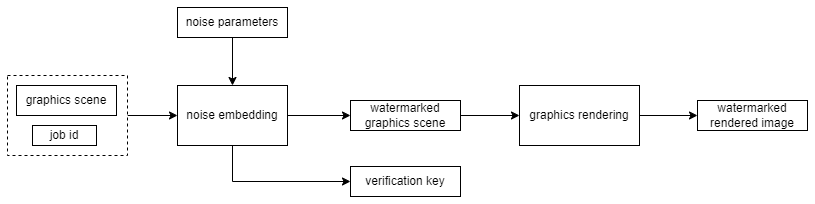

# Algorithms

To handle this problem, we follow the approach of digital watermarking ([\[6\]](../references.md),[\[7\]](../references.md)) and propose a scheme called _Active Noise Generation and Verification_ (ANGV) which is a variant of _proof of ownership_ ([\[8\]](../references.md),[\[9\]](../references.md)). Our scheme has several favorable properties:

1. **Efficiency**: noise generation and verification require much lower computation resources compared with the graphics rendering; the total performance of the system is not affected.
2. **Fidelity**: the scheme needs to modify the initial scene so the rendered output will be distorted; but the distortion is regulated being below the human perception capability, hence there is no loss of quality.
3. **Robustness**: the embedded noises are robust under rendering enhancements (e.g. anti-aliasing) and post-processing operations.
4. **Effectiveness**: there is no need to use special graphics rendering software as in the case of FHE.

## Active Noise Generation and Verification
In current digital watermarking schemes for authentication systems ([\[8\]](../references.md),[\[9\]](../references.md),[\[10\]](../references.md)), invisible watermarks will be embedded into the digital content needed to be protected. The detector (or verifier) tries to extract the watermark from a tested content, then compares the extracted watermark with the original embedded one, if the comparison is passed then that the content is authenticated.

However, in the context of Inferix's rendering network, the __manager__ has access to the image only after the graphics scene has been rendered by __workers__. It is nonsense to embed watermark into the image at this point since the watermarking cannot help to detect any malicious manipulations which may happen before that, i.e. in the rendering process. Our approach is to embed watermarks into the graphics scene submitted by users before sending it to __workers__. The __Active Noise Generation and Verification__ consists of two algorithms as described below.

### Noise Generation
In practice, a graphics scene may contain multiple frames, each job of this scene contains some range of frames to be rendered, consequently each worker may render only a subset of these frames. For the simplification purpose, we assume in this section that a scene has only one frame, so the output image is determined uniquely by the scene.

<figure><figcaption>
Figure 2: Noise generation
</figcaption></figure>

Let $$\mathcal{R}$$ denote the graphics rendering process, for each input graphics scene $$\mathcal{S}$$, the result of the rendering is an image:
$$
\begin{equation}
    I = \mathcal{R} \left( S \right)
\end{equation}
$$
But it is important to remark that $$I$$ is actually never computed, neither by the __manager__ in the watermark insertion procedure nor by __workers__ in rendering processes, the equation above represents only an equality.

Similar with conventional invisible watermark schemes ([\[8\]](../references.md),[\[9\]](../references.md),[\[10\]](../references.md)), a noise $$W$$ is a sequence of atomic watermarks:
$$
\begin{equation}
    W = \left\{ w_1,\dots,w_n \right\}
\end{equation}
$$
where $$w_i \, \left(1 \leq i \leq n\right)$$ is independently chosen from some normal probability distribution $$\mathcal{N}\left(0, \mu^2\right)$$. Furthermore, $$w_i$$ has a special structure depending on where it is introduced in the scene $$S$$. The number $$n$$ of atomic watermark signals is chosen around an experimental human perception threshold.

Together with a uniformly generated job identification number $$J_{\mathtt{id}}$$, we calculate a verification key:
$$
\begin{equation}
    K_{\mathtt{verif}} \left(S, W, J_{\mathtt{id}}\right) = \left\{ k_1,\dots,k_n \right\}
\end{equation}
$$
that will be used later for the noise verification procedure.

The noise $$W$$ is not embedded into the image $$I$$ (we have remarked that embedding watermarks into $$I$$ cannot help the authentication) but into the scene $$S$$ (c.f. [Figure 2:](./#figure2)). Let $$\mathcal{E}$$ denote the noise embedding function, now we now create a watermarked scene:
$$
\begin{equation}
    \hat{S} = \mathcal{E} \left(S, W\right)
\end{equation}
$$
Finally $$\hat{S}$$ is sent to __workers__ for rendering, that results in a rendered image:
$$
\begin{equation}
    \hat{I} = \mathcal{R} \thinspace (\hat{S})
\end{equation}
$$
In case of being accepted, that means $$\hat{I}$$ passes the noise verification which will be presented hereafter, this is the image sent back to the original user (i.e. the owner of the graphics scene $$\mathcal{S}$$), but not the image $$I$$ in [eq. (1)](./#eq1). The encoding function $$\mathcal{E}$$ and the watermark $$W$$ are designed so that the distortion of $$\hat{I}$$ against $$I$$ is under human perception capability, then $$\hat{I}$$ can be authentically used as a result of the graphics rendering.
