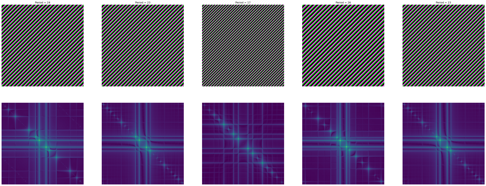

# Implementation

In the previous section, we have described the high-level view of the Active Noise Generation and Verification algorithms. In this section, we present in detail the current implementation of watermark insertion and verification.

## Structure of watermark

Following [Equation 2](algorithms.md), a noise is a random vector $$W = \left(w_i\right)_{1 \leq i \leq n}$$ where each $$w_i$$ is independently chosen from a normal distribution $$\mathcal{N}\left(\mu, \sigma^2\right)$$. The atomic watermark $$w_i$$ is implemented a rectangular image of periodic patterns: we fix some $$M,N$$ for the width and the height of the image; and let $$X_i, Y_i$$ be respectively the periods following the horizontal and vertical axis (these values are chosen from a normal distribution), then:

$$
\begin{equation} w_i(x,y) = e^{2i\pi\left(\frac{x}{X_i} + \frac{y}{Y_i}\right)} \ \left(1 \leq x \leq M, 1 \leq y \leq N \right) \end{equation}
$$

The [Figure 4](implementation.md#structure-of-watermark) presents a noise as a vector of $$5$$ atomic watermarks and the corresponding Fourier transformations. For illustration purpose, we take $$X_i = Y_i$$ where $$X_i \sim \mathcal{N}\left(25,5\right) \ \left(1 \leq i \leq 5\right)$$, and $$M = N = 512$$.

<figure><figcaption>
Figure 4: A random vector of 5 atomic watermarks
</figcaption></figure>
