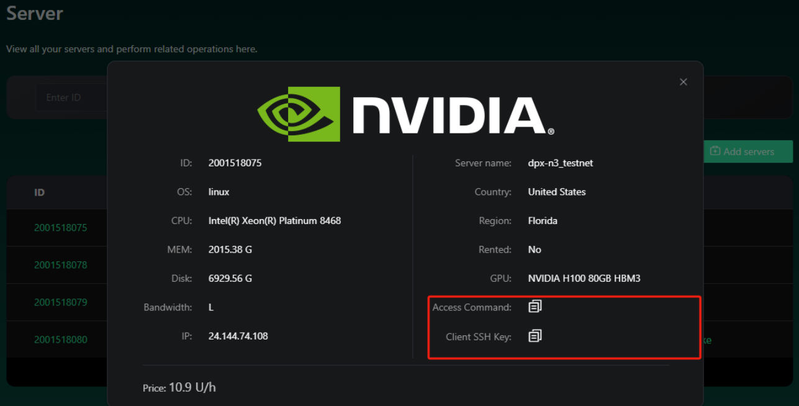

# How to get Whitelisted?

Obtain a Whitelist spot for our Verifier Node Sales by participating in:

* **Whitelist drop for Aethir Node Holders** 
* **Other events with our strategic partners** 
* [**Our referral program for Influencers & Community Leaders (KOLs)**](referral-program.md)\
  _(If you are interested, contact BD team via Telegram to: @nguyen5)_
* **The Inferix Node Whitelist Program 👇**

If you have idle GPUs, you can contribute these precious resources to InferiX Network to earn scores and compete on the leaderboard. The higher rank you are, the higher the chance of obtaining rewards

Duration: 10 — 20 Sep, 2024

<mark style="color:red;background-color:yellow;">**The campaign is extended to 23 Sep, 2024!**</mark>

Rewards: 50 tier 1 to tier 6 Node Whitelist spots & 1,000 $USDT

<figure><figcaption></figcaption></figure>

_How to join?_

Step 1. Go to our [**Website**](https://inferix.io/) & Download MVP for GPU Owner

Step 2. Check out the video tutorial to install Blender and Inferix Worker: [**HERE**](https://www.youtube.com/watch?v=ZPH9tKSPcsE\&t=1s)

_<mark style="color:red;background-color:yellow;">(📌 Keep in mind: install Blender before installing Inferix Worker!)</mark>_

_**👋** Goodbye to the old version:_ For GPU Providers who install the old Inferix Worker before the campaign starting, remember to uninstall the old version and download the latest one from [https://inferix.io/](https://inferix.io/), then install and run it again to see your Node ID

Step 3. Head over to [**Register Form**](https://inferix.io/register) and submit required information for verification

The winner result will be announced after the campaign ends and before the Whitelist sale begins!

Find full details and get started 👉 [**HERE**](https://medium.com/@inferixgpu/inferix-node-whitelist-program-78b278568fc7)
